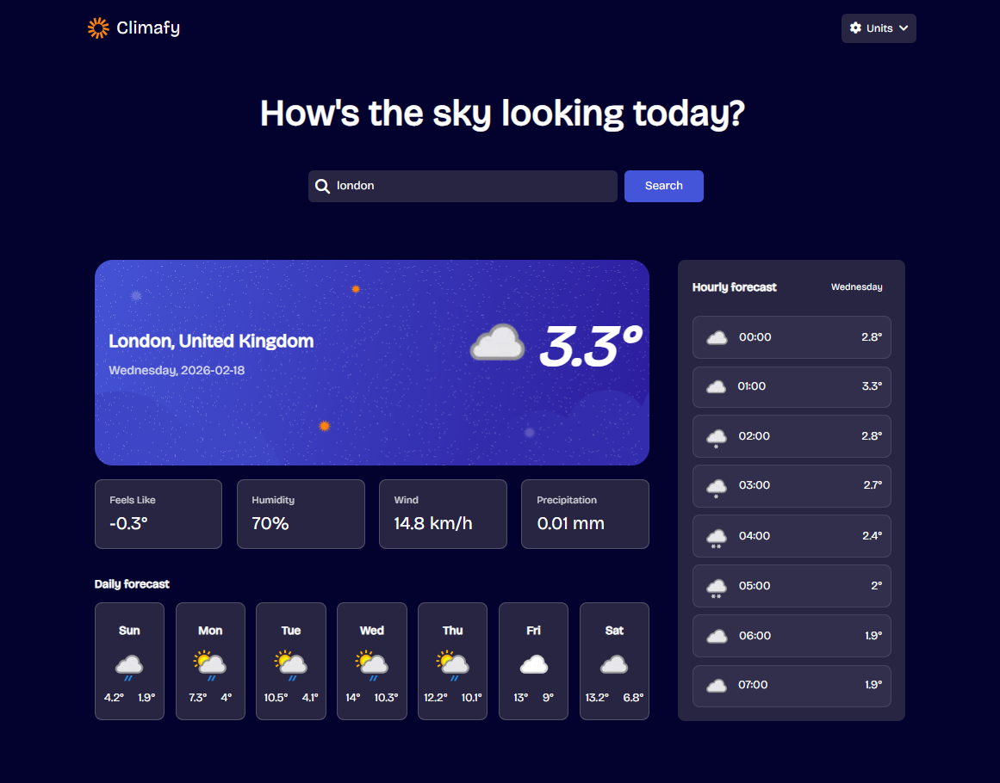
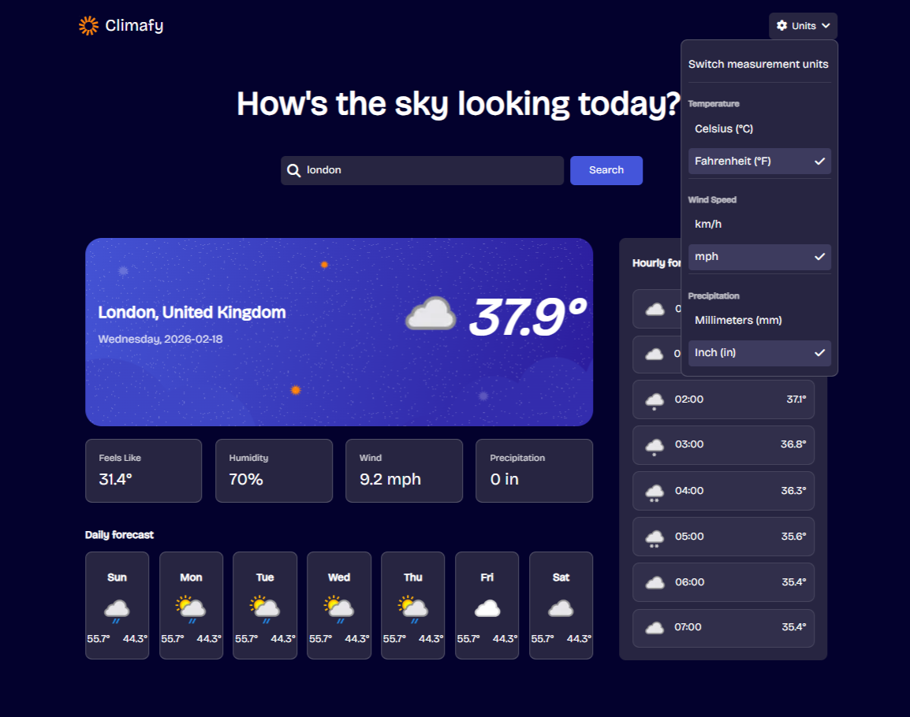
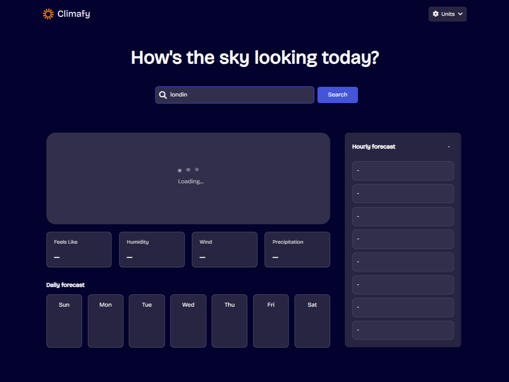

# 🌦 Weather Forecast App

A dynamic weather application that provides real-time current conditions, daily forecasts, and hourly breakdowns using live API data.

 Built with Vanilla JavaScript, dynamic DOM rendering, and clean state handling.

---

## 🚀 Live Preview

[Open Live Demo](https://climafy-app.netlify.app/)

---

## 📌 Overview

This application allows users to:

- Search any city worldwide (e.g. London)

- View real-time temperature and weather conditions

- Check 7-day forecast

- Browse hourly breakdown

- Switch between metric and imperial units

- Handle API errors gracefully

- Experience loading skeleton UI during fetch

The entire UI is dynamically rendered using JavaScript.

---

## 🧠 Architecture & Design Decisions

This project focuses on:

### 1️⃣ Dynamic DOM Construction

All UI components (main container, forecast grid, hourly list) are built using createElement() — no static HTML templating.

### 2️⃣ Controlled Fetch State

A concurrency guard (isFetching) prevents duplicate API requests.

### 3️⃣ Separation of Concerns

- Fetch logic isolated

- Rendering logic separated

- Conversion logic modularized

- UI helpers abstracted

### 4️⃣ Defensive Error Handling

Handles:

- Empty input validation

- HTTP errors

- API logical errors

- Network failures

---

## 🛠 Tech Stack

- HTML5

- CSS3

- Vanilla JavaScript (ES6+)

- WeatherAPI (External API)

No frameworks. No libraries. Pure JS.

---

## ⚙️ Features

### 🌡 Current Weather

- Temperature

- Feels like

- Humidity

- Wind speed

- Precipitation

### 📅 7-Day Forecast

- Daily min/max temperatures

- Weather icons

- Dynamic date handling

### ⏱ Hourly Forecast

- Hour-by-hour temperature

- Weather condition icons

- Clean horizontal UI

### 🔁 Unit Conversion System

Supports:

- Celsius ↔ Fahrenheit

- km/h ↔ mph

- mm ↔ inch

All conversions update dynamically without refetching data.

---

## 🧩 How It Works

1.User submits city name.

2.Loading skeleton UI is generated.

3.Weather data is fetched asynchronously.

4.DOM is populated dynamically.

5.Unit conversion system updates displayed values without reloading.

---

## 🔒 Error Handling Strategy

- Input validation before request

- API error object detection

- HTTP status verification

- Try/Catch network protection

- Retry button for failed states

---

## 🎯 Why This Project Matters

- This project demonstrates:

- Strong DOM manipulation skills

- Async/await proficiency

- Real-world API integration

- Clean state management

- UI state synchronization

- Professional error handling patterns

- It reflects frontend architectural thinking beyond beginner level.

---

## 📸 Screenshots

### Default Search View

### Unit Conversion Dropdown

### Loading Page

### Mobile View

---

## 🧪 Future Improvements

- Refactor unit conversion logic to reduce repetition

- Add localStorage for last searched city

- Add theme switcher (dark/light mode)

- Implement caching layer

- Improve mobile responsiveness

- Interactive daily forecast: When a day is selected from the daily forecast list, the hourly temperatures for that specific day will be displayed (coming soon)

---

## 👤 Author

Abd Almoen Albarbari

Frontend Developer
